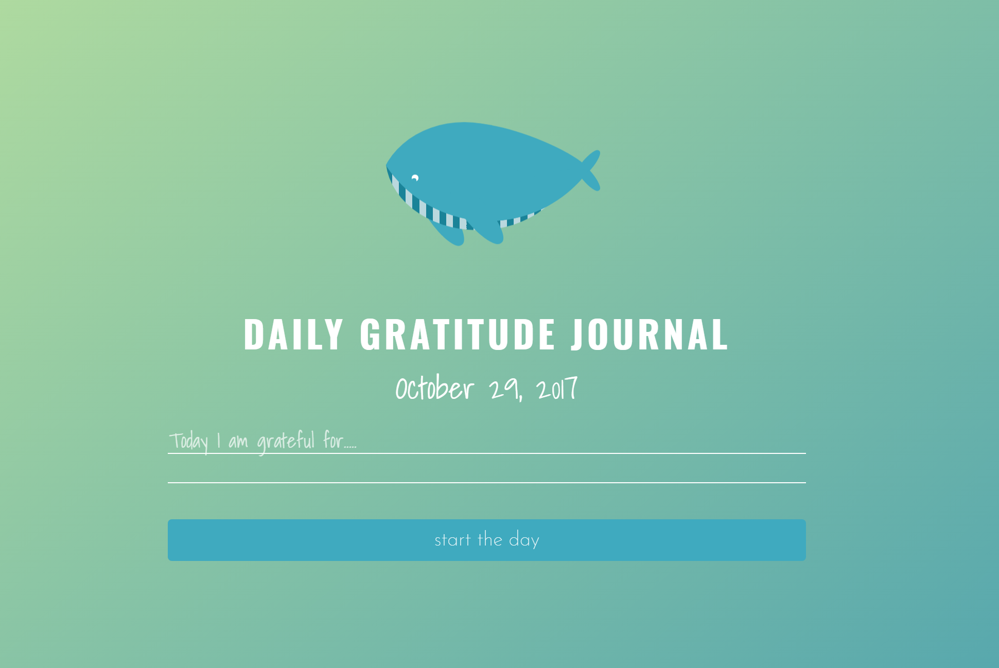
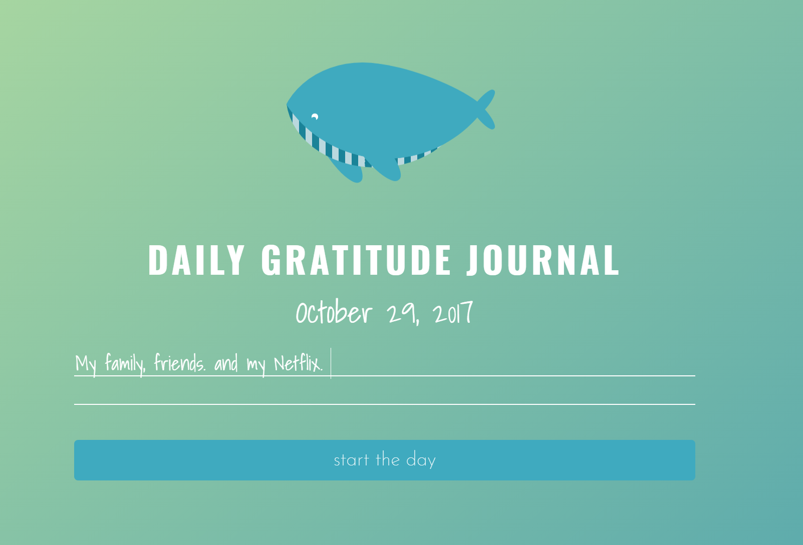
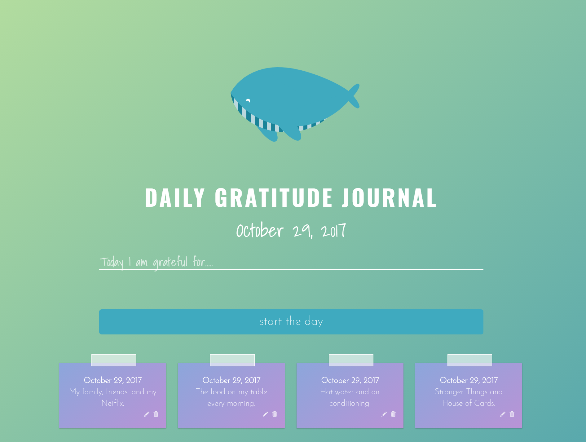

# Daily Gratitude Journal
Studies show that gratitude can improve physical and psychological health as well as enhance empathy and reduce aggression. This Daily Gratitude Journal will help start your day out right with a beautiful UI. Whale-come to my app. 

## Table of contents

- [Demo](#demo)
- [Screenshots](#screenshots)
- [Installation](#installation)

## Demo
👉 Watch it <a href="https://daily-gratitude-journal.herokuapp.com/" target="_blank">here</a>.
<br>

## Screenshots:

  #### On Load
  
  
  #### Adding an Entry
  
  
  #### List of Entries after Submitting
  
  

## Installation

### For Developers
Clone the source locally:

```sh
$ git clone https://github.com/jsorkin24/calendar-web-app.git
```

Use your package manager to install `npm`.

Install project dependencies:

```sh
$ npm install
```
Start the app:
```sh
$ mongod
```

```sh
$ nodemon
```

### Build Installers
Build app
```sh
$ gulp
```


